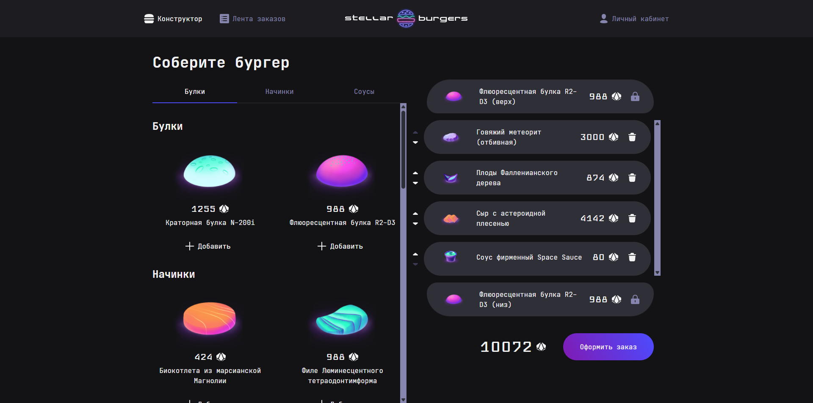
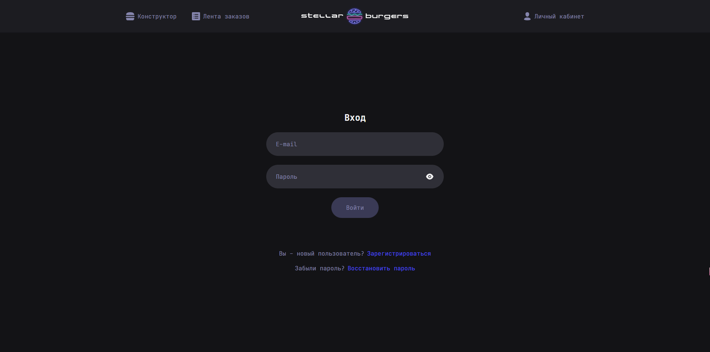
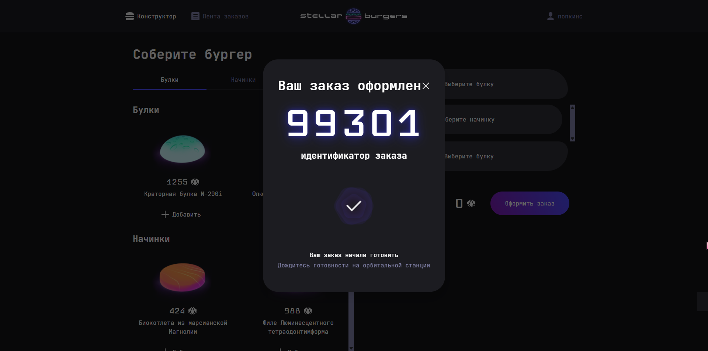
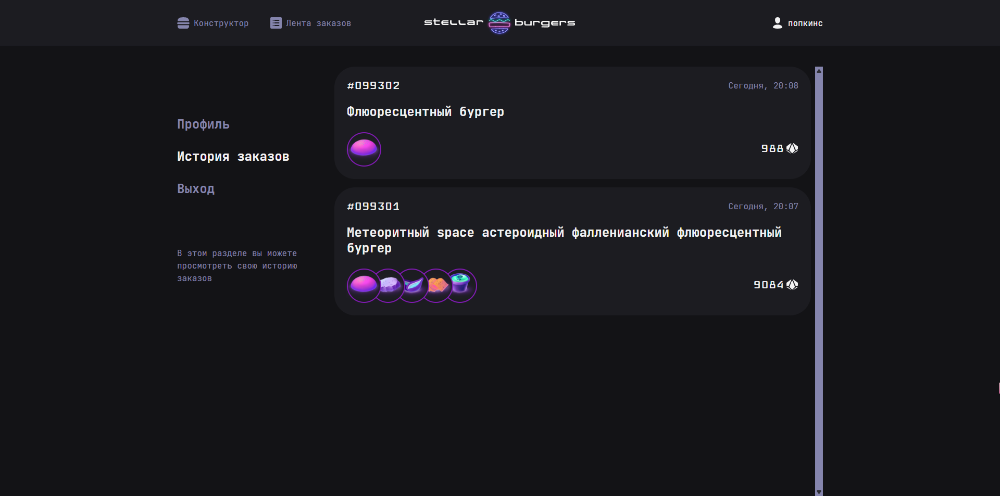
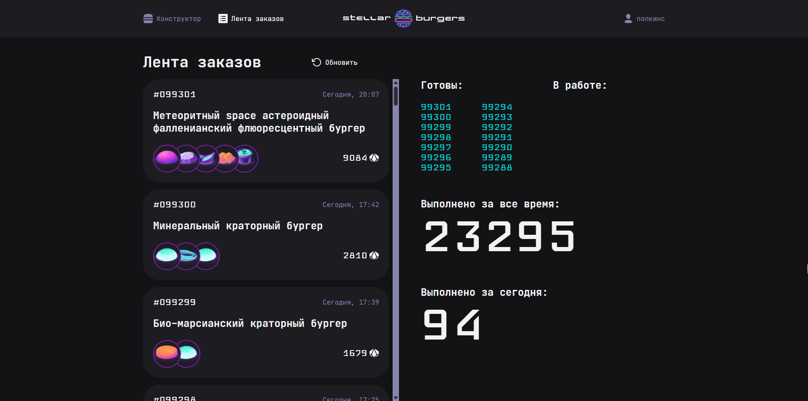

# Stellar Burger

---

Учебный проект, доработанный мной для портфолио.

## О проекте
Stellar Burger — веб-приложение для заказа космических бургеров.  
Пользователи могут создавать заказы, просматривать ленту заказов, управлять своим профилем и историей заказов.  

## Моя роль и вклад
Проект полностью реализован мной на основе учебного макета.  
Я отвечала за:

- подключение Redux и реализацию глобального состояния
- работу с API и интеграцию данных на страницы
- маршрутизацию с React Router, включая защищённые маршруты для авторизованных пользователей
- реализацию личного кабинета и истории заказов
- работу с модальными окнами (ингредиенты, заказы)
- динамическое обновление ленты заказов в реальном времени

## Функциональность
- Регистрация и авторизация пользователей
- Личный кабинет с возможностью редактировать профиль
- Создание и просмотр заказов
- Лента заказов с подсчетом стоимости и real-time обновлением
- Модальные окна с детальной информацией об ингредиентах и заказах
- Доступ к истории заказов только для авторизованных пользователей

## Стек технологий
- React + TypeScript
- Redux / Redux Toolkit
- React Router
- API / REST
- Jest / Testing Library (тестирование)
- Webpack
- CSS / BEM

## Чему я научилась
- Работа с глобальным состоянием через Redux
- Настройка защищённых маршрутов и авторизации
- Построение real-time интерфейсов
- Интеграция сложных UI-компонентов и модальных окон
- Организация крупного фронтенд-проекта с React + TS

## Скриншоты

## Репозиторий
[Stellar Burger GitHub](https://github.com/AlekSidorova/stellar-burgers)
